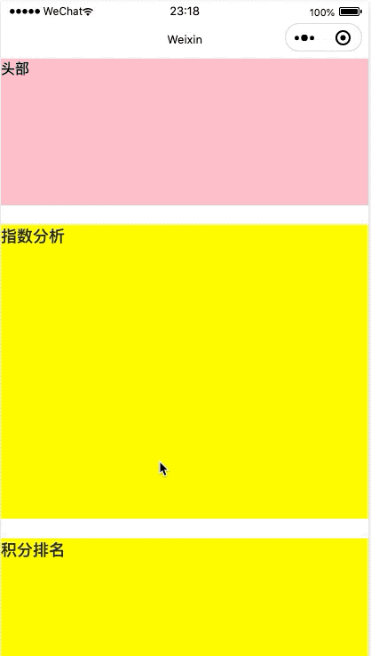

# easy-wx-elevator

微信小程序自定义电梯 elevator 组件，支持多个组件之间跳转

> 由于项目使用了可选链语法，因此运行本项目需要开启：本地设置-增强编译

## 使用组件

### 1.在页面配置文件.json 中引入

```json
{
  "usingComponents": {
    "easy-wx-elevator": "../../../components/easy-wx-elevator"
  }
}
```

### 2.在页面视图文件.wxml 中使用组件

```html
<easy-wx-elevator
  dataSource="{{elevatorDataSource}}"
  defaultActiveKey="{{1}}"
  needHide="{{true}}"
  timerKeepOn="{{3000}}"
  bind:onClick="handleClickElevator"
/>
```

### 3.在页面逻辑文件.js 中传入数据源

```javaScript
Page({
  data: {
    // 电梯组件数据源
    elevatorDataSource: [
      {
        key: 1,
        label: "指数",
        anchor: "#section-index",
      },
      {
        key: 2,
        label: "积分",
        anchor: "#section-range",
      },
      {
        key: 3,
        label: "交锋",
        anchor: "#section-against",
      },
      {
        key: 4,
        label: "战绩",
        anchor: "#section-recent",
      },
      {
        key: 5,
        label: "赛程",
        anchor: "#section-schedule",
      },
    ],
  },

  // 点击电梯组件
  handleClickElevator(e) {
    console.log(e.detail);
  }
})
```

## 效果展示



## 参数说明

配置部分主要配置这么几个属性，分别是：

| 参数             | 说明                         | 类型           | 默认值  | 是否必填 |
| ---------------- | ---------------------------- | -------------- | ------- | -------- |
| dataSource       | 组件渲染数据源               | Array          | []      | 否       |
| defaultActiveKey | 默认选中电梯楼层             | Number\|String | 0       | no       |
| needHide         | 页面不滚动时是否隐藏         | boolean        | false   | 否       |
| timerKeepOn      | 从页面不滚动到隐藏的时间(ms) | Number         | 3000    | 否       |
| themeColor       | 电梯组件主题色               | String         | #FF2A84 | 否       |
| onClick          | 电梯组件点击事件             | Function       |         | 否       |
